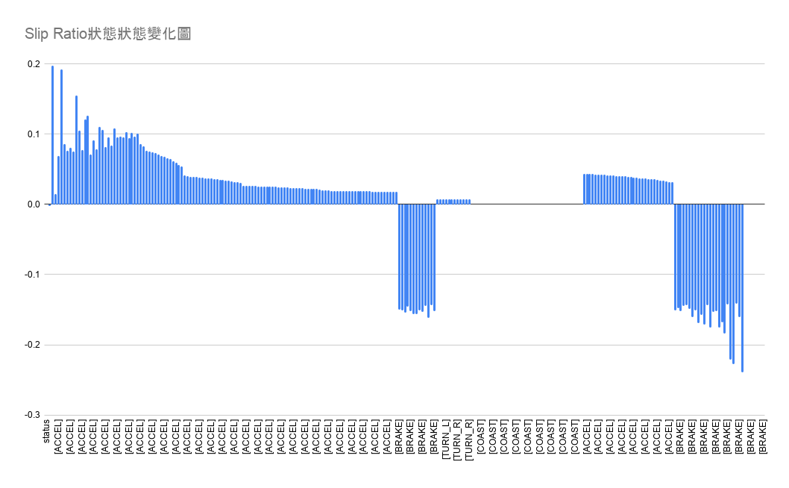
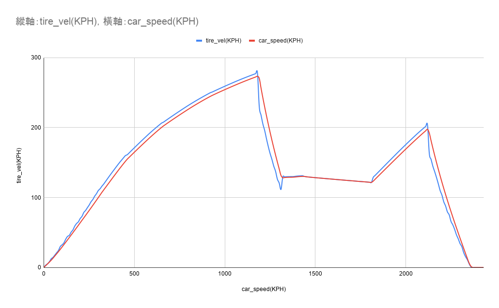
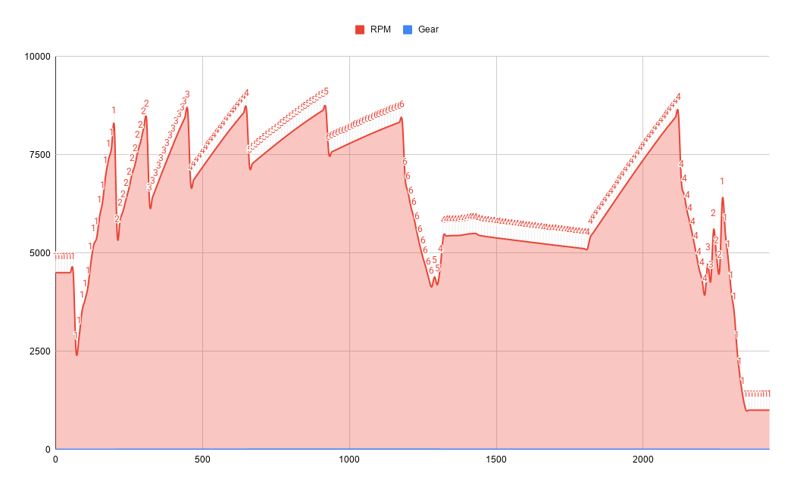
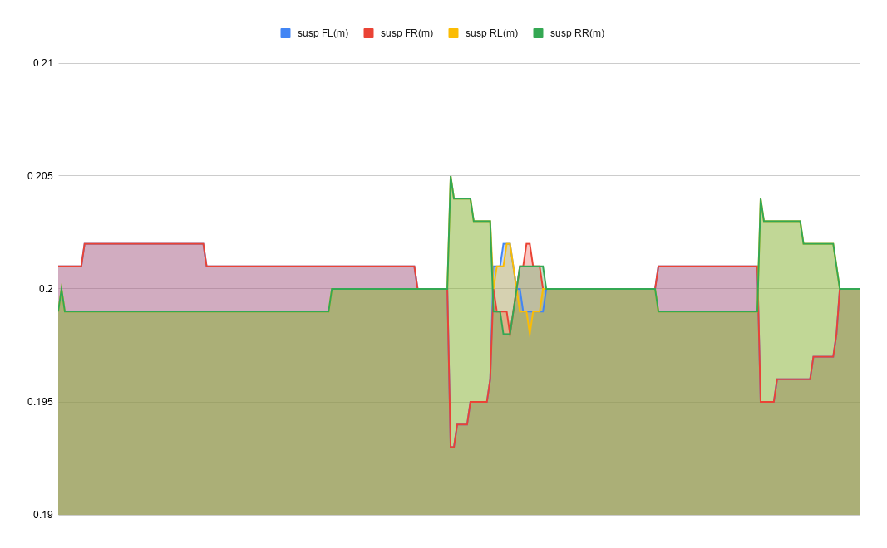

# 駕駛模擬器

## 專題資訊

| 項目 | 內容 |
| --- | --- |
| 組別號碼 | 第五組 |
| 系級班級 | 資工 1B |
| 成員 | 曾恩舜、宋旻陽 |
| 小專題題目 | 駕駛模擬器 |

## 程式介紹

本專題是一套以 C++ 撰寫的車輛行駛物理引擎模擬程式。程式會根據不同 GT3 車款的引擎、變速箱、空氣力學、輪胎與懸吊參數，模擬車輛在加速、煞車、轉向與滑行時的物理狀態，並在主控台輸出即時遙測資料。

模擬輸出的資料包含車速、輪胎速度、檔位、轉速、滑移率、滑移角、四輪懸吊長度、轉向角與車輛世界座標，可用來觀察車輛在不同操作階段下的動態反應。

## 遊戲規則

執行程式後，依照主控台提示輸入 `1`、`2` 或 `3`，即可選擇要模擬的車輛並開始執行。

| 輸入 | 車輛 |
| --- | --- |
| `1` | BMW M4 GT3 |
| `2` | Porsche 911 GT3 R |
| `3` | Mercedes-AMG GT3 |

若輸入範圍外的數字，程式會顯示「無效的選擇」並結束。

## 模擬流程

程式開始後會依序進行不同駕駛狀態的模擬：

1. 加速：車輛全油門加速，觀察車速、RPM 與升檔變化。
2. 煞車：施加煞車力，觀察車速下降與輪胎滑移。
3. 左轉與右轉：輸入轉向角，觀察滑移角、車身位置與懸吊變化。
4. 滑行：停止油門與煞車輸入，觀察車輛自然減速。
5. 再加速與煞車：再次測試車輛在高速狀態下的動態反應。

## 程式架構

本專題使用物件導向方式設計，主要類別如下：

| 檔案 | 功能 |
| --- | --- |
| `Vehicle` | 車輛父類別，整合引擎、變速箱、輪胎、懸吊與空氣力學系統 |
| `AMGGT3` | Mercedes-AMG GT3 子類別，設定該車款專屬參數 |
| `BMWM4GT3` | BMW M4 GT3 子類別，設定該車款專屬參數 |
| `Porsche911GT3R` | Porsche 911 GT3 R 子類別，設定該車款專屬參數 |
| `Engine` | 模擬引擎轉速與扭力輸出 |
| `Gearbox` | 模擬檔位、齒比、升檔與降檔 |
| `AeroDynamics` | 模擬空氣阻力與下壓力 |
| `Suspension` | 模擬四輪懸吊受力與壓縮狀態 |
| `Tire` / `TireDynamics` | 模擬輪胎速度、抓地力、滑移率與滑移角 |
| `main.cpp` | 程式進入點，負責車輛選擇、模擬流程與主控台輸出 |

## 執行方式

本專題使用 CMake 建置，需先安裝支援 C++17 的編譯器與 CMake。

```bash
cmake -S . -B build
cmake --build build
./build/CarGame
```

在 Windows 環境中，若使用 Visual Studio 或 MSVC 編譯，可透過 CMake 產生對應的建置檔後執行 `CarGame.exe`。

## 運行畫面

[點此前往運行畫面](https://drive.google.com/file/d/1Pp1k1LmT8CsIaRiFlCtzEAYTjIalrnjC/view?usp=drive_link)

## 運行截圖


## 資料彙整輸出圖

以下圖表由主控台遙測資料整理而成，可用來觀察車輛在不同狀態下的速度、轉速、滑移率與懸吊變化。

### Slip Ratio 狀態變化圖



### Tire Velocity 與 Car Speed 關係圖



### RPM 與 Frame 變化圖



### Suspensions 狀態變化圖



## 分工資訊

| 成員 | 負責內容 |
| --- | --- |
| 曾恩舜 | 程式主架構設計、車輛父類別撰寫、程式 Bug 偵錯與排解、流程圖繪製 |
| 宋旻陽 | 程式主架構設計、子類別撰寫、簡報製作、測試資料輸入 |

## 專題特色

- 使用物件導向設計，將車輛共通功能集中在 `Vehicle` 父類別。
- 透過不同子類別建立 BMW、Porsche 與 Mercedes-AMG 三種 GT3 車款。
- 模擬引擎、變速箱、輪胎、懸吊與空氣力學等車輛物理系統。
- 以主控台遙測資料呈現車輛行駛時的速度、轉速、檔位、滑移與懸吊狀態。
- 可透過輸入數字快速切換不同車款進行比較。
